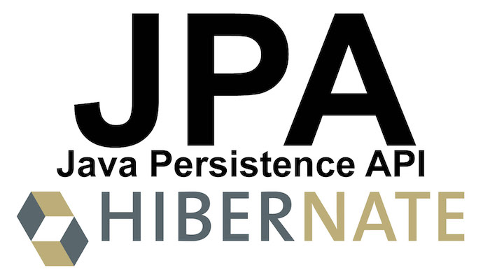

# Java Persistence API

Java Persistence API (ou simplesmente JPA) é uma API padrão da linguagem Java que descreve uma interface comum para frameworks de persistência de dados. A JPA define um meio de mapeamento objeto-relacional para objetos Java simples e comuns (POJOs), denominados beans de entidade. Diversos frameworks de mapeamento objeto/relacional como o Hibernate implementam a JPA. Também gerencia o desenvolvimento de entidades do Modelo Relacional usando a plataforma nativa Java SE e Java EE.

# Objetivo 

O principal objetivo dessa aplicação e demonstrar como inserir e alterar dados no banco de dados usando jpa, aplicação vai realizar a criação da tabela e cadastro dos clientes no banco, projeto foi desenvolvido baseado na arquitetura do Spring boot.

